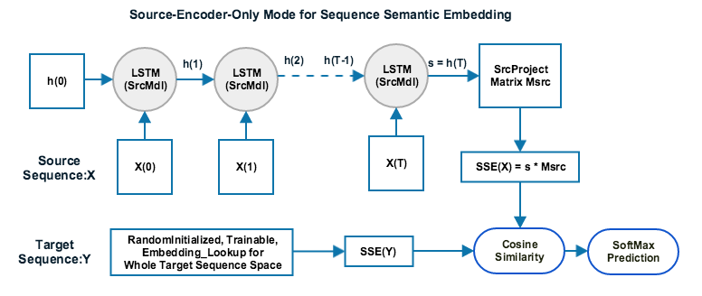
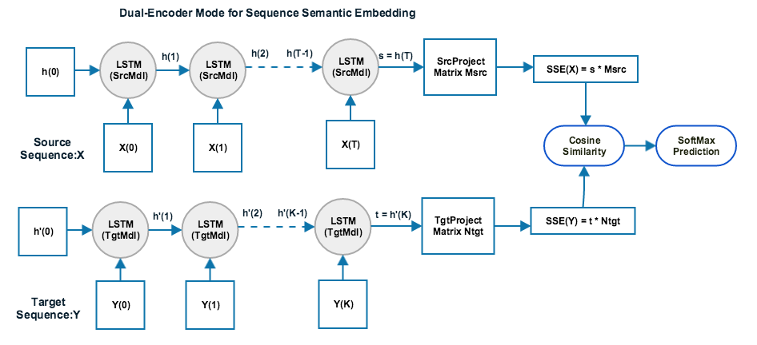
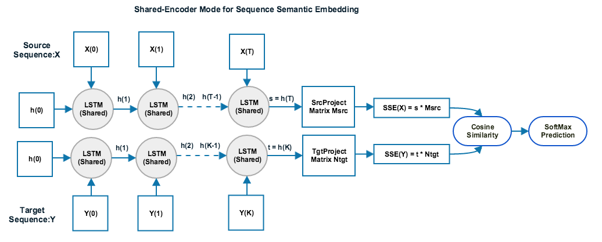

# Sequence-Semantic-Embedding

SSE(Sequence Semantic Embedding) is an encoder framework toolkit for natural language processing related tasks. It's implemented in TensorFlow by leveraging TF's convenient deep learning blocks like DNN/CNN/LSTM etc.

SSE model translates a sequence of symbols into a vector of numbers, so that different sequences with similar semantic meanings will have closer vector distances. This numeric vector is called the SSE for the original sequence of symbols. SSE can be applied to some large scale NLP related machine learning tasks. For example:
* **Text classification task**: e.g., mapping an eBay listing title or eBay search query to one or multiples of the 20,000+ leaf categories in eBay website.
* **Search engine relevance ranking task**: e.g., mapping a search query to some most relevant documents in eBay inventory.
* **Question answering task**: e.g.,  mapping a question to its most suitable answers from a set of FAQ document.
* **Cross lingual information retrieval task**: e.g., mapping a Chinese/English/English-Chinese-Mixed search query to its most relevant eBay inventory listing without the need of calling machine translation.

Depending on each specific task, similar semantic meanings can have different definitions. For example, in the category classification task, similar semantic meanings means that for each correct pair of (listing-title, category), the SSE of listing-title is close to the SSE of corresponding category.  While in the information retrieval task, similar semantic meaning means for each relevant pair of (query, document), the SSE of query is close to the SSE of relevant document. While in the question answering task, the SSE of question is close to the SSE of correct answers.

This repo contains some sample raw data, tools and recipes to allow user establish complete End2End solutions from scratch for four different typical NLP tasks: text classification, relevance ranking, cross-language information retrieval and question answering. This includes deep learning model training/testing pipeline, index generating pipeline, command line demo app, and the run-time RESTful webservices with trained models for these NLP tasks. By replacing supplied raw data with your own data, users can easily establish a complete solution for their own NLP tasks with this deep learning based SSE tech.

Here is the quick-start instruction to build a text classification webservice from scratch including download the repo, setup environment, train model, run demo app and setup RESTful webservice.


```bash
git clone https://github.com/eBay/Sequence-Semantic-Embedding.git
cd Sequence-Semantic-Embedding
./env_setup.sh
make train-classificastion
make index-classification
make demo-classification
export FLASK_APP=webserver.py
export MODEL_TYPE=classification
export INDEX_FILE=targetEncodingIndex.tsv
python -m flask run --port 5000 --host=0.0.0.0
```

Once webserver has started, you can open a browse and send a GET request like: http://your-computer-ip-address:5000/api/classify?keywords=sunglasses


See the [Content](#content) below for more details on how SSE training works, and how to use it to build the complete solution for your own NLP task with your own dataset.

### [Content](#content)

* [Setup Instructions](#setup-instructions)
* [SSE Model Training](#sse-model-training)
    * [Basic Idea](#basic-idea)
    * [Training Data](#training-data)
    * [Train Model](#train-model)
    * [Visualize Training progress in TensorBoard](#visualize-training-progress-in-tensorboard)
* [Index Generating](#index-generating)
* [Command Line Demo](#command-line-demo)
* [Setup WebService](#setup-webservice)
* [Call WebService to get results](#call-webservice-to-get-results)
* [Build Your Own NLP task services with your data](#build-your-own-nlp-task-services-with-your-data)
    * [Text Classification](#text-classification)
    * [Search Relevance Ranking](#search-relevance-ranking)
    * [Cross-Lingual Information Retrieval](#cross-lingual-information-retrieval)
    * [Question Answering](#question-answering)
* [References](#references)

---

## Setup Instructions

The code of SSE toolkit support both python2 and python3. Just issue below command to download the repo and install dependencies such as tensorflow.

``` bash
git clone https://github.com/eBay/Sequence-Semantic-Embedding.git
cd Sequence-Semantic-Embedding
./env_setup.sh
```

## SSE Model Training

### Basic Idea

SSE encoder framework supports three different types of network configuration modes: source-encoder-only, dual-encoder and shared-encoder. 

* In source-encoder-only mode, SSE will only train a single encoder model(RNN/LSTM/CNN) for source sequence. For target sequence, SSE will just learn its sequence embedding directly without applying any encoder models. This mode is suitable for closed target space tasks such as classification task, since in such tasks the target sequence space is limited and closed thus it does not require to generate new embeddings for any future unknown target sequences outside of training stage. A sample network config diagram is shown as below:
    

* In dual-encoder mode, SSE will train two different encoder models(RNN/LSTM/CNN) for both source sequence and target sequence. This mode is suitable for open target space tasks such as relevance ranking, cross-lingual information retrieval, or question answering, since the target sequence space in those tasks is open and dynamically changing, a specific target sequence encoder model is needed to generate embeddings for new unobserved target sequence outside of training stage. A sample network config diagram is shown as below:
    

* In shared-encoder mode, SSE will train one single encoder model(RNN/LSTM/CNN) shared for both source sequence and target sequence. This mode is suitable for open target space tasks such as question answering system or relevance ranking system, since the target sequence space in those tasks is open and dynamically changing, a specific target sequence encoder model is needed to generate embeddings for new unobserved target sequence outside of training stage. In shared-encoder mode, the source sequence encoder model is the same as target sequence encoder mode. Thus this mode is better for tasks where the vocabulary between source sequence and target sequence are similar. A sample network config diagram is shown as below:
    

### Training Data

This repo contains some sample raw datasets for four types of NLP task in below four subfolders:

* **rawdata-classification**: 
  
  This classification sample data is limited to eBay CSA (Clothes, Shoes and Accessaries) category classification task. The source sequence data is eBay listing titles, and the target sequence data is 571 different leaf categories about shoes, clothes and accessaries in eBay website. The unziped DataSet.tar.gz contains three text files named as TrainPairs, EvalPairs and targetIDs. The targetIDs file contains 571 target's category_class_name and category_class_ID, seperated by tab. The format of TrainPair/EvalPair is source_sequence(listing title), and target_class_id(category id), seperated by tab. 
  
  An example line in targetIDs file:
  ```
  Clothing, Shoes & Accessories:Kids' Clothing, Shoes & Accs:Boys' Clothing (Sizes 4 & Up):Jeans	77475
  ```

  An example line in TrainPair file:
  ```
  Abercrombie boys jeans size 12 Nice!	77475
  ```
  
* **rawdata-qna**: 

  This question answering sample data is limited to a small set of eBay customer support's Frequent Asked Questions documents set. The source sequence data is user's asked questions, and the target sequence data is the content of most suitable FAQ answer document. The unziped DataSet.tar.gz contains three text files named as TrainPairs, EvalPairs and targetIDs. The targetIDs file contains the FAQ answer document content and their IDs, seperated by tab. The format of TrainPair/EvalPair is source_sequence(user asked questions), and target_class_id(FAQ answer document ID), seperated by tab. 
  
* **rawdata-ranking**: 

  This search ranking sample data contains nearly 1 million product titles and 84K search queries about Clothes, Shoes and Accessariese in eCommerce domain. The source sequence data is user search query, and the target sequence data is a list of relevant listing titles corresponding to the given query. The unziped DataSet.tar.gz contains three text files named as TrainPairs, EvalPairs and targetIDs. The targetIDs file contains nearly 1 million listing titles and listing_ID, seperated by tab. The format of TrainPair/EvalPair is source_sequence(search query) and list of relevant listing ids. 
  
  An example line in targetIDs file:
  ```
  air jordan xii 12 white/dynamic pink size 4y 7y valentine's day gs pre order	Item#876583
  ```

  An example line in TrainPair file:
  ```
  air jordan 12 gs dynamic pink	Item#876583|Item#439598|Item#563089|Item#709305|Item#460164|Item#45300|Item#791751|Item#523586|Item#275794|Item#516742|Item#444557|Item#700634|Item#860517|Item#775042|Item#731907|Item#852612|Item#877692|Item#453434|Item#582210|Item#200407|Item#196434
  ```

* **rawdata-crosslingual**: 

  This initial released cross lingual information retrieval sample dataset contains nearly 19K product titles in English and 16.5K Chinese/English/Chinese-English-Mixed search queries about Clothes, Shoes and Accessariese in eCommerce domain. The source sequence data is user search query, and the target sequence data is a list of relevant listing titles corresponding to the given query. The unziped DataSet.tar.gz contains three text files named as TrainPairs, EvalPairs and targetIDs. The targetIDs file contains nearly 19K English listing titles and listing_ID, seperated by tab. The format of TrainPair/EvalPair is source_sequence(search query) and list of relevant listing ids. 
  
  A larger set of cross lingual information retrieval sample dataset will be released in near future. Please stay tuned.

  A few example lines in targetIDs file:
  ```
  fashion retro british style ankle boot autumn young men's motorcycle martin boot	272925135276
  men's new balance nb ww847 sneakers athletic shoes size sz us13 us 13 black	253234434750
  womens white pink runway style tshirt viva coco cuba print 2017 celebstyle	282402455930
  new ballet dance yoga gymnastics canvas slipper shoes	121650244307
  ```

  A few example lines in TrainPair file:
  ```
  英伦风马丁靴	272925135276|253235556652|202115504586
  nb 男鞋	253234434750|263286843065|272906918403|352206006036|282713345418|232543899635
  coco t恤	282402455930|172847234178|222245444217
  white dance shoes	121650244307|372062893666|252088843333
  ```
  
### Train Model

To start training your models, issue command as below. For classification task, use option of *train-classification* ; for question answer task, use option of *train-qna*, for relevance ranking task use option of *train-ranking*, for cross-lingual task use option of *train-crosslingual*

``` bash
make train-classification
```

### Visualize Training progress in TensorBoard

Use below command to start TF's tensorboard and view the Training progress in your webbrowser.

``` bash
tensorboard --logdir=models-classification
```

## Index Generating

  For open target space tasks like search ranking, question answering or cross-lingual information retrieval, there is a need to generate SSE embeddings for new unobserved target sequences outside of model training stage. 
  
  You can use below commands to generate SSE embedding index for your new target data outside of model training stage. 
  
Use default parameters:

``` bash
#use default settings: modelDir=models-ranking ,  rawTargetFile=targetIDs, targetSSEIndex=targetEncodingIndex.tsv
make index-ranking
```
Use customizable parameters:

``` bash
python sse_index.py  --idx_model_dir=models-ranking --idx_rawfilename=targetIDs --idx_encodedIndexFile=targetEncodingIndex.tsv
```


## Command Line Demo

Use below command to start the demo app and then follow the prompt messages. 

``` bash
make demo-classification
```

## Setup WebService

``` bash
export SSE_MODEL_DIR=models-classification
export INDEX_FILE=targetEncodingIndex.tsv
export FLASK_APP=webserver.py
python -m flask run --port 5000 --host=0.0.0.0
```


## Call WebService to get results

Once the webserver starts, you can use below curl command to test its prediction results for your NLP task.

``` bash
curl -i -H "Accept: application/json" -H "Content-Type: application/json" -X GET http://<your-ip-address>:5000/api/classify?keywords=men's running shoes
```
or you can just open a web browser and put a GET request like below to see your NLP task service result:

```
http://<your-ip-address>:5000/api/classify?keywords=men's running shoes
```


## Build Your Own NLP task services with your data

###  Text Classification

The mission of text classification task is to classify a given source text sequence into the most relevant/correct target class(es). If there is only one possible correct class label for any given source text, i.e., the class labels are exclusive to each other, this is called single-label text classification task. If there are multiple correct class labels can be associated with any given source text, i.e., the class labels are independent to each other, this is called multiple-label text classification task.

The current supplied sample classification raw dataset is from single-label text classification task. A newer version sample data for multiple-label text classification raw dataset will be released in near future.

If you want to train the model and build the webservice with your own dataset from scratch,  you can simply replace zip file in rawdata-classification folder with your own data and keep the same data format specified in [Training Data](#training-data) section. And then issue below commands to train out your own model, build the demo app and setup your webservice:

```bash
make train-classificastion
make index-classification
make demo-classification
export FLASK_APP=webserver.py
export INDEX_FILE=targetEncodingIndex.tsv
export MODEL_TYPE=classification
python -m flask run --port 5000 --host=0.0.0.0
```

Once the webserver starts, you can just open a web browser and put a GET request like below to see your text classification service result:

```
http://<your-ip-address>:5000/api/classify?keywords=men's running shoes
```

The webserver will return a json object with a list of top 10 (default) most relevant target class with ID, names and matching scores.

### Question Answering

The mission of question answering task is to provide the most relevant answer for a given question. The example we provided here is for simple question answering scenarios.  We have a set of FAQ answer documents, when a user asking a question, we provide the most relevant FAQ answer document back to the user.

If you want to build your own question answering webservice with your own FAQ dataset from scratch,  you can simply replace the zip file in rawdata-qna folder with your own data and keep the same data format specified in [Training Data](#training-data) section. And then issue below commands to train out your own model, build the index, run the demo app and setup the webservice:


```bash
make train-qna
make index-qna
make demo-qna
export FLASK_APP=webserver.py
export MODEL_TYPE=qna
export INDEX_FILE=targetEncodingIndex.tsv
python -m flask run --port 5000 --host=0.0.0.0
```

Once the webserver starts, you can just open a web browser and put a GET request like below to see your question answering web service result:

```
http://<your-ip-address>:5000/api/qna?question=how does secure pay work&?nbest=5
```

The webserver will return a json object with a list of top 5 (default) most relevant answer document with document_ID, document_content and matching scores.


### Search Relevance Ranking

The mission of search relevance ranking task is to provide the most relevant documents for a given search query from a vast amount of documents. The provided sample dataset allows user search relevant items from nearly 1 million eBay listings about Clothes, Shoes and Accessariese in eCommerce domain.

If you want to build your own search relevance ranking webservice with your own domain dataset from scratch,  you can simply replace the zip file in rawdata-ranking folder with your own data and keep the same data format specified in [Training Data](#training-data) section. And then issue below commands to train out your own model, build the index, run the demo app and setup the webservice:


```bash
make train-ranking
make index-ranking
make demo-ranking
export FLASK_APP=webserver.py
export MODEL_TYPE=ranking
export INDEX_FILE=targetEncodingIndex.tsv
python -m flask run --port 5000 --host=0.0.0.0
```

Once the webserver starts, you can just open a web browser and put a GET request like below to see your search ranking web service result:

```
http://<your-ip-address>:5000/api/search?query=red nike shoes&?nbest=10
```

The webserver will return a json object with a list of top 10 (default) most relevant item with listing_title, Item_ID,  and matching scores.


### Cross-lingual Information Retrieval

The mission of cross lingual information retrieval task is to provide most relevant documents for a given search query(in various or mixed languages) from a vast amount of documents. The provided sample dataset allows user find relevant eBay items about Clothes, Shoes and Accessariese using query in English or Chinese or English-Chinese mixed without machine translation.

If you want to build your own cross-lingual information retrieval webservice with your own domain dataset from scratch,  you can simply replace the zip file in rawdata-crosslingual folder with your own data and keep the same data format specified in [Training Data](#training-data) section. And then issue below commands to train out your own model, build the index, run the demo app and setup the webservice:


```bash
make train-crosslingual
make index-crosslingual
make demo-crosslingual
export FLASK_APP=webserver.py
export MODEL_TYPE=crosslingual
export INDEX_FILE=targetEncodingIndex.tsv
python -m flask run --port 5000 --host=0.0.0.0
```

Once the webserver starts, you can just open a web browser and put a GET request like below to see your crosslingual IR web service result:

```
http://<your-ip-address>:5000/api/crosslingual?query=jeep夹克&?nbest=10
```

The webserver will return a json object with a list of top 10 (default) most relevant item with listing_title, Item_ID,  and matching scores.

## References

More detailed information about the theory and practice for deep learning(DNN/CNN/LSTM/RNN etc.) in NLP area can be found in papers and tutorials as below:

 * [ Deep Learning for Natural Language Processing: Theory and Practice (Tutorial) ](https://www.microsoft.com/en-us/research/wp-content/uploads/2016/02/CIKM14_tutorial_HeGaoDeng.pdf)
 * [ Learning Semantic Representations Using Convolutional Neural Networks for Web Search ](https://www.microsoft.com/en-us/research/publication/learning-semantic-representations-using-convolutional-neural-networks-for-web-search/)
 * [ Deep Sentence Embedding Using LSTM Networks: Analysis and Application to Information Retrieval ](http://arxiv.org/abs/1502.06922)
 * [ Sequence to Sequence Learning with Neural Networks ](http://arxiv.org/abs/1409.3215)
 * [ Neural Machine Translation by Jointly Learning to Align and Translate ](http://arxiv.org/abs/1409.0473)
 * [ On Using Very Large Target Vocabulary for Neural Machine Translation ](http://arxiv.org/abs/1412.2007)
 * [ Tensorflow's Machine Translation Implementation based on Seq2Seq model ](https://github.com/tensorflow/tensorflow/blob/master/tensorflow/models/rnn/translate)
 * [ SubwordText tokenizer from Tensor2Tensor project](https://github.com/tensorflow/tensor2tensor/blob/master/tensor2tensor/data_generators/text_encoder_build_subword.py)